Hi, I’m Mozart—a full-stack developer passionate about learning and building smart, scalable solutions. I thrive in fast-paced environments, quickly picking up new tools and diving into every part of the development cycle—from backend architecture to frontend UX. With a strong analytical mindset and a love for problem-solving, I aim to create tech that truly makes a difference.

  
  

